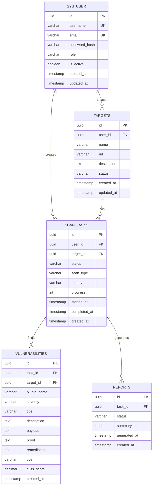

# 数据库ERD图

## 核心表结构

### 用户表 (sys_user)

| 字段名 | 数据类型 | 约束 | 说明 |
|--------|----------|------|------|
| id | UUID | PRIMARY KEY | 用户唯一标识 |
| username | VARCHAR(50) | NOT NULL, UNIQUE | 用户名 |
| email | VARCHAR(100) | NOT NULL, UNIQUE | 邮箱 |
| password_hash | VARCHAR(255) | NOT NULL | 密码哈希 |
| role | VARCHAR(20) | NOT NULL | 用户角色 |
| is_active | BOOLEAN | NOT NULL DEFAULT true | 是否激活 |
| created_at | TIMESTAMP | NOT NULL DEFAULT CURRENT_TIMESTAMP | 创建时间 |
| updated_at | TIMESTAMP | NOT NULL DEFAULT CURRENT_TIMESTAMP | 更新时间 |

### 目标表 (targets)

| 字段名 | 数据类型 | 约束 | 说明 |
|--------|----------|------|------|
| id | UUID | PRIMARY KEY | 目标唯一标识 |
| user_id | UUID | NOT NULL, FOREIGN KEY | 创建用户ID |
| name | VARCHAR(100) | NOT NULL | 目标名称 |
| url | VARCHAR(500) | NOT NULL | 目标URL |
| description | TEXT | NULL | 目标描述 |
| status | VARCHAR(20) | NOT NULL | 目标状态 |
| created_at | TIMESTAMP | NOT NULL DEFAULT CURRENT_TIMESTAMP | 创建时间 |
| updated_at | TIMESTAMP | NOT NULL DEFAULT CURRENT_TIMESTAMP | 更新时间 |

### 扫描任务表 (scan_tasks)

| 字段名 | 数据类型 | 约束 | 说明 |
|--------|----------|------|------|
| id | UUID | PRIMARY KEY | 任务唯一标识 |
| user_id | UUID | NOT NULL, FOREIGN KEY | 创建用户ID |
| target_id | UUID | NOT NULL, FOREIGN KEY | 目标ID |
| status | VARCHAR(20) | NOT NULL | 任务状态 |
| scan_type | VARCHAR(20) | NOT NULL | 扫描类型 |
| priority | VARCHAR(20) | NOT NULL | 优先级 |
| progress | INTEGER | NOT NULL DEFAULT 0 | 进度百分比 |
| started_at | TIMESTAMP | NULL | 开始时间 |
| completed_at | TIMESTAMP | NULL | 完成时间 |
| created_at | TIMESTAMP | NOT NULL DEFAULT CURRENT_TIMESTAMP | 创建时间 |

### 漏洞表 (vulnerabilities)

| 字段名 | 数据类型 | 约束 | 说明 |
|--------|----------|------|------|
| id | UUID | PRIMARY KEY | 漏洞唯一标识 |
| task_id | UUID | NOT NULL, FOREIGN KEY | 任务ID |
| target_id | UUID | NOT NULL, FOREIGN KEY | 目标ID |
| plugin_name | VARCHAR(100) | NOT NULL | 检测插件名称 |
| severity | VARCHAR(20) | NOT NULL | 严重级别 |
| title | VARCHAR(200) | NOT NULL | 漏洞标题 |
| description | TEXT | NOT NULL | 漏洞描述 |
| payload | TEXT | NULL | 攻击载荷 |
| proof | TEXT | NULL | 证据 |
| remediation | TEXT | NOT NULL | 修复建议 |
| cve | VARCHAR(50) | NULL | CVE编号 |
| cvss_score | DECIMAL(3,1) | NULL | CVSS评分 |
| created_at | TIMESTAMP | NOT NULL DEFAULT CURRENT_TIMESTAMP | 创建时间 |

### 报告表 (reports)

| 字段名 | 数据类型 | 约束 | 说明 |
|--------|----------|------|------|
| id | UUID | PRIMARY KEY | 报告唯一标识 |
| task_id | UUID | NOT NULL, FOREIGN KEY | 任务ID |
| status | VARCHAR(20) | NOT NULL | 报告状态 |
| summary | JSONB | NOT NULL | 扫描摘要 |
| generated_at | TIMESTAMP | NULL | 生成时间 |
| created_at | TIMESTAMP | NOT NULL DEFAULT CURRENT_TIMESTAMP | 创建时间 |

## Mermaid ERD图

## 枚举类型

### 用户角色 (UserRole)

| 值 | 说明 |
|----|------|
| admin | 管理员 |
| user | 普通用户 |

### 目标状态 (TargetStatus)

| 值 | 说明 |
|----|------|
| active | 活跃 |
| inactive | 非活跃 |

### 任务状态 (TaskStatus)

| 值 | 说明 |
|----|------|
| pending | 等待中 |
| running | 运行中 |
| completed | 已完成 |
| failed | 失败 |
| cancelled | 已取消 |

### 扫描类型 (ScanType)

| 值 | 说明 |
|----|------|
| full | 全面扫描 |
| quick | 快速扫描 |
| custom | 自定义扫描 |

### 优先级 (TaskPriority)

| 值 | 说明 |
|----|------|
| low | 低 |
| medium | 中 |
| high | 高 |
| critical | 紧急 |

### 漏洞严重级别 (VulnerabilitySeverity)

| 值 | 说明 | CVSS范围 |
|----|------|----------|
| critical | 严重 | 9.0-10.0 |
| high | 高危 | 7.0-8.9 |
| medium | 中危 | 4.0-6.9 |
| low | 低危 | 0.1-3.9 |
| info | 信息 | 0.0 |
